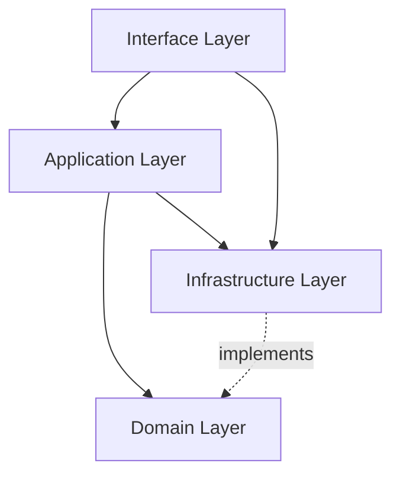
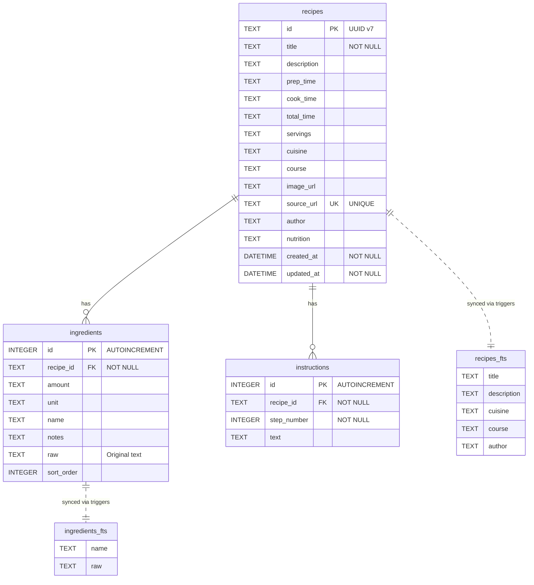

# Architecture

RecipeBox follows a **Domain-Driven Design (DDD)** layered architecture. Dependencies point inward — outer layers depend on inner layers, never the reverse.

## Layer Diagram



## Project Structure

```
recipebox/
├── main.go                          # Entry point, Cobra root command
├── cmd/                             # CLI subcommands
│   ├── register.go                  # Registers all commands
│   ├── serve.go                     # Start web server
│   ├── list.go                      # List recipes
│   ├── search.go                    # Search recipes
│   └── show.go                      # Show recipe details
├── internal/
│   ├── domain/                      # Core business logic (no dependencies)
│   │   ├── entity/                  # Recipe, Ingredient, Instruction
│   │   ├── repository/              # Repository interface
│   │   └── service/                 # Scraper interface
│   ├── application/                 # Use cases & orchestration
│   │   ├── command/                 # ImportRecipe, DeleteRecipe
│   │   ├── query/                   # GetRecipe, ListRecipes, SearchRecipes
│   │   ├── dto/                     # Data transfer objects
│   │   ├── mapper/                  # Entity <-> DTO mapping
│   │   └── service/                 # RecipeService orchestrator
│   ├── infrastructure/              # External implementations
│   │   ├── database/                # SQLite connection & migrations
│   │   ├── repository/              # SQLite repository implementation
│   │   └── scraper/                 # HTTP fetcher, JSON-LD & WPRM extractors
│   └── interface/web/               # HTTP layer
│       ├── server.go                # Echo setup & routes
│       ├── handler/                 # Request handlers
│       └── template/                # templ templates
├── zensical.toml                    # Documentation config
└── docs/                            # Documentation source
```

## Domain Layer

The innermost layer contains the core business entities and interfaces with zero external dependencies.

### Entities

- **Recipe** — The aggregate root with fields for title, description, times, servings, cuisine, course, source URL, and more
- **Ingredient** — Value object with amount, unit, name, notes, and raw text fallback
- **Instruction** — Value object with step number and text
- **ValidatedRecipe** — Wrapper ensuring domain invariants are satisfied before persistence

### Interfaces (Ports)

- **RecipeRepository** — Defines persistence operations (Save, FindByID, FindAll, Search, Delete)
- **RecipeScraper** — Defines the scraping contract (ScrapeRecipe)

## Application Layer

Orchestrates use cases using CQRS-style separation:

- **Commands** — `ImportRecipeCommand`, `DeleteRecipeCommand`
- **Queries** — `GetRecipeByIDQuery`, `ListRecipesQuery`, `SearchRecipesQuery`
- **RecipeService** — Coordinates between the scraper and repository

## Infrastructure Layer

Implements the domain interfaces:

- **SQLite Repository** — Full CRUD with FTS5 search, transactions, and cascade deletes
- **Recipe Scraper** — Orchestrates JSON-LD (primary) and WPRM (fallback) extractors
- **HTTP Fetcher** — Retrieves web pages for scraping

## Interface Layer

Handles HTTP concerns:

- **Echo Server** — Route registration and middleware
- **Handlers** — Map HTTP requests to application service calls
- **templ Templates** — Type-safe HTML generation with Bulma CSS styling

## Database

SQLite with three tables (`recipes`, `ingredients`, `instructions`) and two FTS5 virtual tables (`recipes_fts`, `ingredients_fts`) kept in sync via triggers. Ingredients and instructions are stored as separate rows rather than JSON to enable full-text search on individual fields.

### ER Diagram



All foreign keys use `ON DELETE CASCADE` so deleting a recipe removes its ingredients and instructions automatically. The FTS5 virtual tables are kept in sync via `AFTER INSERT`, `AFTER UPDATE`, and `AFTER DELETE` triggers.
